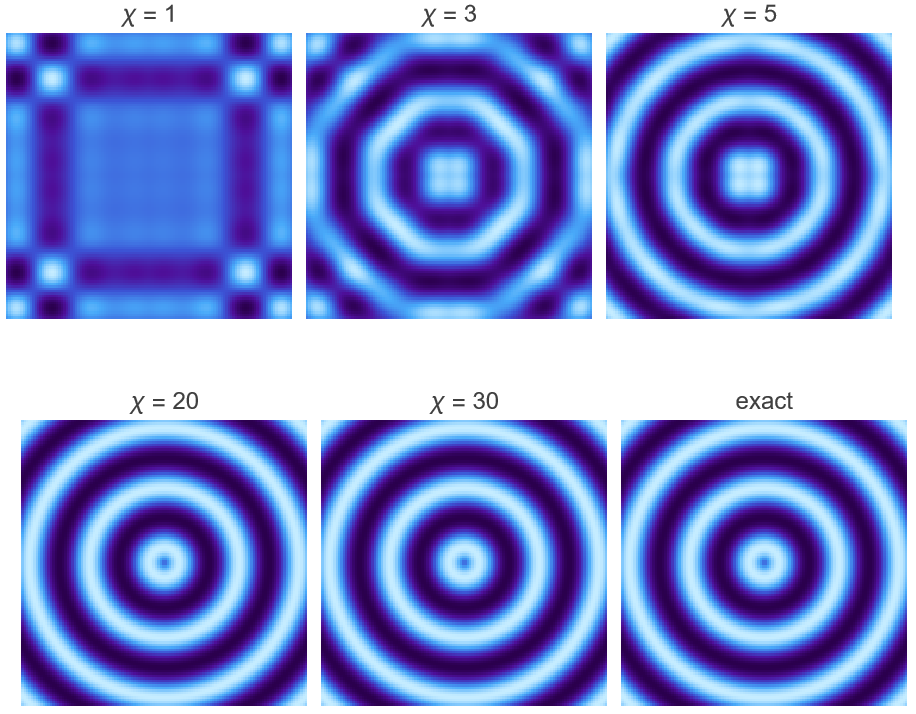

# TensorTrainContract
Contract a tensor train (TT) of low-rank cores back into the dense multidimensional array it represents.

> Also published in the [Wolfram Function Repository](https://resources.wolframcloud.com/FunctionRepository/resources/TensorTrainContract/).

## Usage

```mathematica
TensorTrainContract[tensorTrain]
```

Contracts the tensor train tensorTrain formed by the rank-3 cores `{A1, A2, ..., An}` back into the dense array it represents.

## Details

- `TensorTrainContract` rebuilds a full dense array from its Tensor Train (also known as Matrix Product State) representation. It is the inverse of [`TensorTrainDecomposition`](https://github.com/rubenranval/TensorTrainDecomposition/).
- The input is a nonempty list of rank-3 arrays $\{A_1, A_2, \ldots, A_n\}$, where $n$ is the number of dimensions of the resulting array.
- The bond dimension is the size of the internal contracted indices linking adjacent cores; it sets the rank and compression level of the train.
- Each core $A_k$ has dimensions $\{\chi_{k-1},\, d_k,\, \chi_k\}$, where $d_k$ is the size of the $k^\text{th}$ dimension of the result and $\chi_k$ is the bond dimension between cores $k$ and $k+1$.
- The first core has $\chi_0 = 1$ and the last core has $\chi_n = 1$.
- Contracting the cores returned by `TensorTrainDecomposition` recovers the original array — exactly up to floating-point error when the decomposition was exact, or up to the truncation error when a `"MaxBondDimension"` cap or nonzero `Tolerance` was applied.

## Examples

### Basic Examples

Decompose a tensor and contract it back to recover the original array:

```mathematica
tensor = RandomReal[1, {2, 3, 4}];

tensorTrain = TensorTrainDecomposition[tensor];

recon = TensorTrainContract[tensorTrain];
```

The original and reconstructed tensors are equal up to floating-point error.

### Applications

Because contraction works on any valid train, you can decompose with a capped bond dimension and contract the result to get a low-rank approximation of the original tensor. The residual is the truncation error:

```mathematica
largeTensor = RandomReal[{-1, 1}, {4, 4, 4, 4}];

compressed = TensorTrainDecomposition[largeTensor, "MaxBondDimension" -> 2];
approx = TensorTrainContract[compressed];

```

### Possible Issues

Cores whose adjacent bond dimensions do not match cannot be contracted (here the trailing bond `3` does not meet the leading bond `4`):

```mathematica
TensorTrainContract[{RandomReal[1, {1, 2, 3}], RandomReal[1, {4, 2, 1}]}]
```

The function issues an explanatory message and returns `$Failed`.

The first and last cores must have a boundary bond dimension of `1`:

```mathematica
TensorTrainContract[{RandomReal[1, {2, 3, 1}]}]
```

Here the single core has a leading bond dimension of `2` rather than `1`, so the function again reports the problem and returns `$Failed`.

### Neat Examples

Reconstruct a non-separable pattern from tensor trains of increasing bond dimension to watch a low-rank approximation sharpen into the exact array:

```mathematica
n = 120;
c = (n + 1)/2;
pattern = Table[Sin[Sqrt[(i - c)^2 + (j - c)^2]/4.], {i, n}, {j, n}];
ranks = {1, 3, 5, 20, 30};
recons = Table[
   TensorTrainContract[
    TensorTrainDecomposition[pattern, "MaxBondDimension" -> r]], {r, ranks}];
Row[MapThread[
   ArrayPlot[#1, ColorFunction -> "DeepSeaColors", Frame -> False,
      ImageSize -> 150, PlotLabel -> #2] &,
   {Append[recons, pattern],
    Append[("\[Chi] = " <> ToString[#] &) /@ ranks, "exact"]}]]
```



## Usage

Load the function directly from the Wolfram Function Repository:

```mathematica
ResourceFunction["TensorTrainContract"][train]
```

Or load the source from this repository into a session:

```mathematica
Get["path/to/TensorTrainContract.wl"]
```
## License
MIT License

Copyright (c) 2026 Ruben Ranval

Permission is hereby granted, free of charge, to any person obtaining a copy of this software and associated documentation files (the "Software"), to deal in the Software without restriction, including without limitation the rights to use, copy, modify, merge, publish, distribute, sublicense, and/or sell copies of the Software, and to permit persons to whom the Software is furnished to do so, subject to the following conditions:

The above copyright notice and this permission notice shall be included in all copies or substantial portions of the Software.

THE SOFTWARE IS PROVIDED "AS IS", WITHOUT WARRANTY OF ANY KIND, EXPRESS OR IMPLIED, INCLUDING BUT NOT LIMITED TO THE WARRANTIES OF MERCHANTABILITY, FITNESS FOR A PARTICULAR PURPOSE AND NONINFRINGEMENT. IN NO EVENT SHALL THE AUTHORS OR COPYRIGHT HOLDERS BE LIABLE FOR ANY CLAIM, DAMAGES OR OTHER LIABILITY, WHETHER IN AN ACTION OF CONTRACT, TORT OR OTHERWISE, ARISING FROM, OUT OF OR IN CONNECTION WITH THE SOFTWARE OR THE USE OR OTHER DEALINGS IN THE SOFTWARE.
